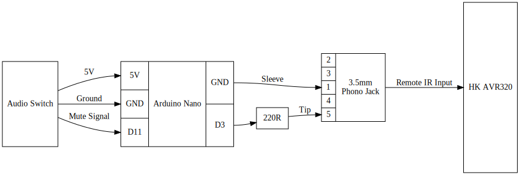

# AVR Controller Project

This is a simple project designed to control a Harmon Kardon AVR 320 receiver based on sensing the status of an automatic S/PDIF switch using the Arduino Nano (ATmega328P with CH340).

I want to give a special shout out to the following indivduals:
*  Benjamin Kerschner - Benjamin was a tremendous help in helping me interface with his switch. I can't say enough on what an amazing person he is.
*  David L. Jones - David runs EEVblog, a fantastic youtube channel. His code and explainations helped to jumpstart this project.

## Major Components
This project is basically an extention board for an amazing audio switch made by Benjamin Kerschner. It uses the following major components:
*  [Automatic SPDIF (Optical/RCA) Audio Switch](https://www.tindie.com/products/Beni_Skate/automatic-spdif-opticalrca-audio-switch)
    - Made by Benjamin Kerschner (avaiable from Tindie), use firmware revision 1.1.1 or later
*  [Elegoo Arduino Nano v3.0 (ATmega328P with CH340)](https://www.amazon.com/gp/product/B071NMBP4S)
    - by Elegoo (available from Amazon)
*  [Aike 3.5mm Plastic PCB Mount 5-Pin Stereo Socket Audio Connector](https://www.amazon.com/gp/product/B01N5DIZQG)
    - by Aike (available from Amazon)

### Putting it all together
The setup is pretty simple. The Arduino sources power and the state of the mute signal from the Audio switch, then sends a demodulated NEC IR signal to the HK AVR 320 receiver.

This is a functional diagram of how things are wired up:


Please see the [Daughter Board Module](module.md) for a more specific parts list and detailed instructions for building the module. The final project looks like this when completed:

| Internal View | External View |
|:-------------:|:-------------:|
 |  |


## Programming the Arduino Nano

### Getting started
1.  Start the Vagrant Dev Box:
    ```
    vagrant up
    vagrant ssh
    ```
2.  Connect your Elegoo Arduino Nano (ATmega328P with CH340) to the USB port

### Building
1.  From within the Vagrant Dev Box `vagrant ssh`:
    ```
    cd /vagrant
    make && sudo make upload && sudo make monitor
    ```

NOTE: use: `ctrl-a \` to quit from screen


### Useful links for programming the Arduino Nano

The following links provide useful info on programming infrared:
*  [SB-Projects - IR - NEC](https://www.sbprojects.net/knowledge/ir/nec.php)
    - NEC infrared protocol explaination.
*  [EEVblog #506 - IR Remote Control Arduino Protocol Tutorial](https://www.youtube.com/watch?v=BUvFGTxZBG8)
    - This is a great video on sending IR commands from the Arduino.
*  [Arduino-IR-TX-NEC](https://gist.github.com/EEVblog/6206934)
    - Sample code from EEVblog that helped with the core IR functions and timing for this project.

The following links were useful in putting the example project together:
*  [Arduino CLI Hacking](http://www.raspberryvi.org/stories/arduino-cli.html)
*  [Screen Quick Reference](http://aperiodic.net/screen/quick_reference)
*  [Arduino and Linux TTY](https://playground.arduino.cc/Interfacing/LinuxTTY)
*  [USB on a Vagrant Box](https://sonnguyen.ws/connect-usb-from-virtual-machine-using-vagrant-and-virtualbox/)

This project was tested with:
*  Ubuntu 18.04.1 LTS (GNU/Linux 4.15.0-29-generic x86_64)
*  Ubuntu Package: arduino-core, Version: 2:1.0.5+dfsg2-4.1
*  Ubuntu Package: arduino-mk, Version: 1.5.2-1
*  Arduino HW: Elegoo Arduino Nano v3.0 (ATmega328P with CH340)
*  Vagrant, Version: 2.2.2
*  Virtual Box, Version: 5.2.22
*  Virtual Box Extention Pack, Version: 5.2.22
*  VM Box: geerlingguy/ubuntu1804 Version: 1.0.5
