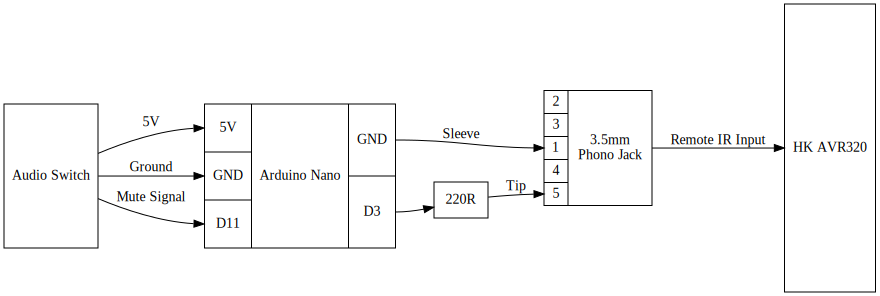
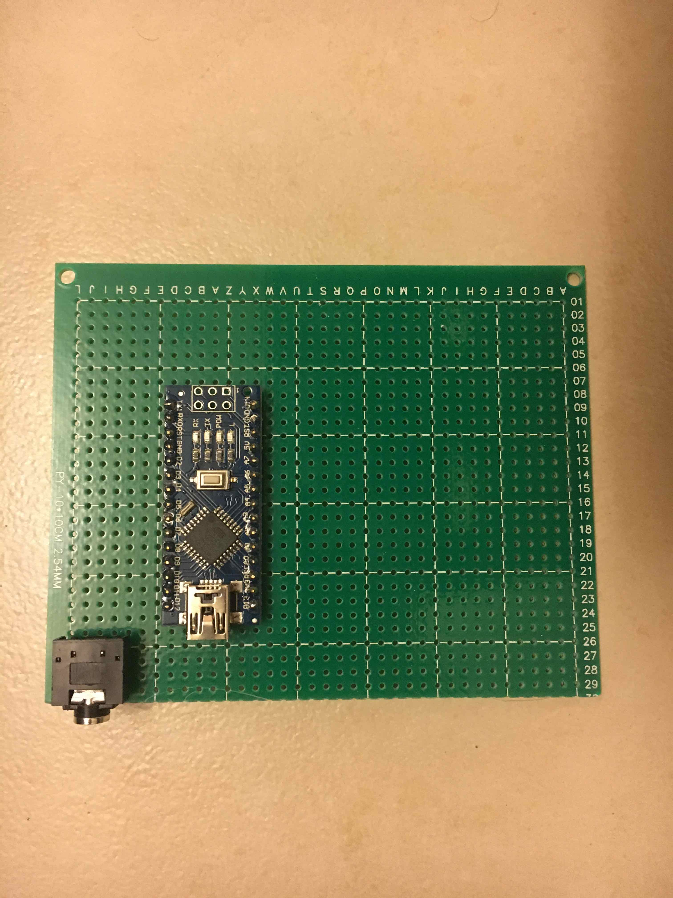
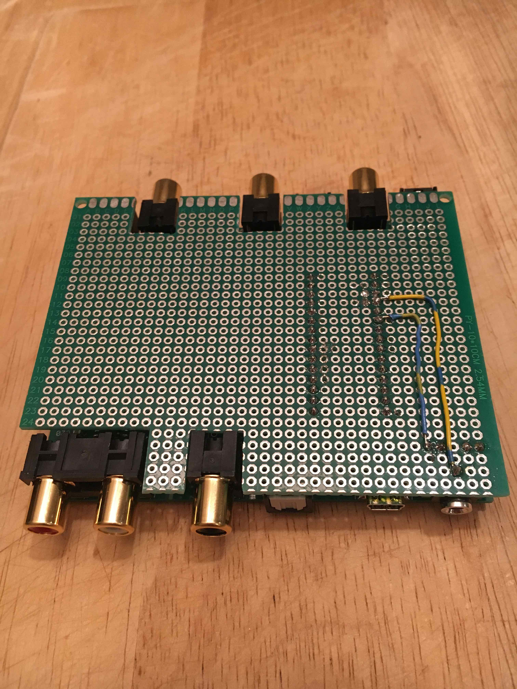
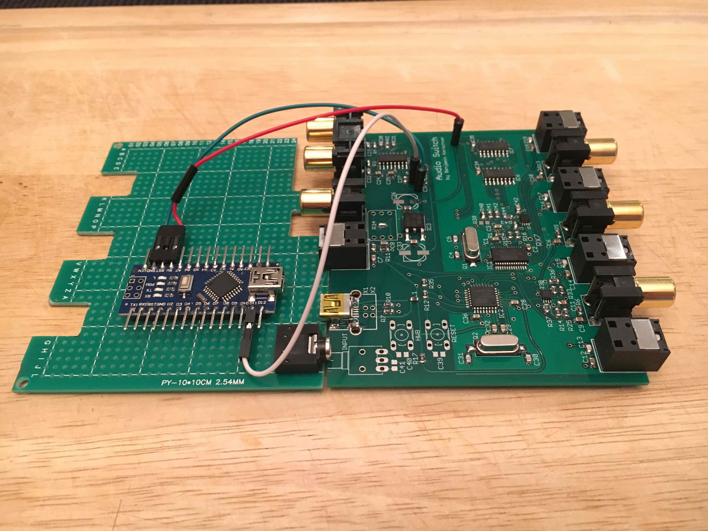
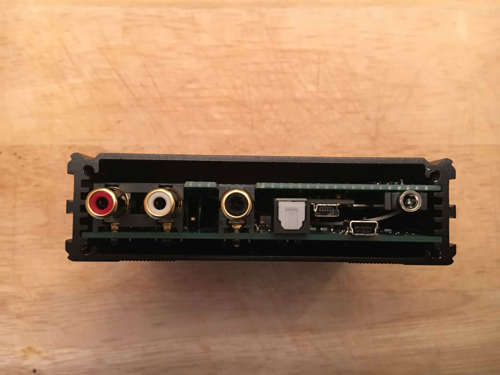
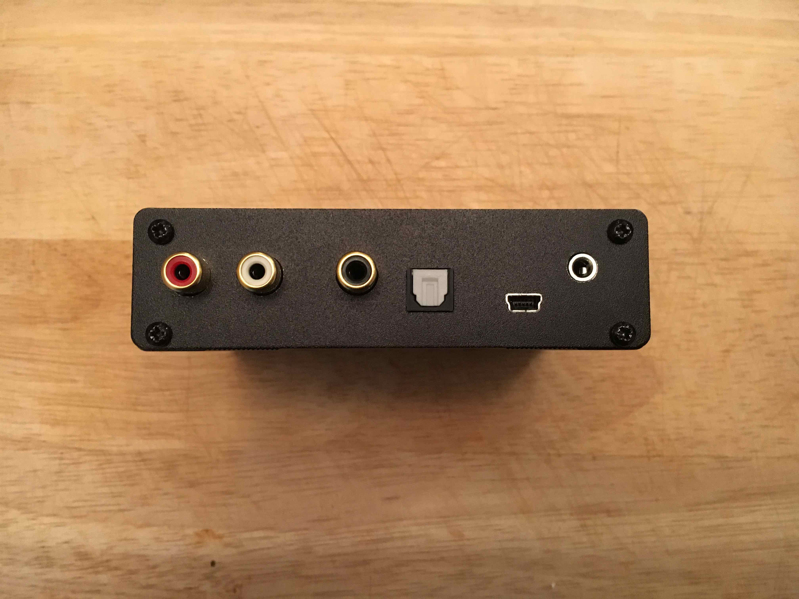

# Daughterboard Module for Audio Switch

These are the instructions to create a daughter board module for the Audio Switch created by Benjamin Kerschner. This project adds an Arduino Nano (ATmega328P with CH340) with a 3.5mm IR remote ouput jack to the Audio Switch. The nano is powered by regulated 5V voltage supplied by the Audio Switch USB port.

## Parts list
This project is basically an extention board for an amazing audio switch made by Benjamin Kerschner. It uses the following parts:
*  [Automatic SPDIF (Optical/RCA) Audio Switch](https://www.tindie.com/products/Beni_Skate/automatic-spdif-opticalrca-audio-switch)
    - Made by Benjamin Kerschner (avaiable from Tindie), use firmware revision 1.1.1 or later
*  [Elegoo Arduino Nano v3.0 (ATmega328P with CH340)](https://www.amazon.com/gp/product/B071NMBP4S)
    - by Elegoo (available from Amazon)
*  [Uxcell 10cm x 10cm Single Sided PCB](https://www.amazon.com/gp/product/B07DTHTXTZ)
    - by Uxcell (available from Amazon)
*  [Male to Male Jumper Cable Wires](https://www.amazon.com/gp/product/B00ARTWJ44)
    - by MECO (available from Amazon)
*  [Aike 3.5mm Plastic PCB Mount 5-Pin Stereo Socket Audio Connector](https://www.amazon.com/gp/product/B01N5DIZQG)
    - by Aike (available from Amazon)

I also used some parts I had laying around, but here are some links to kits that contain those parts:
*  [Dupont Connector Housing](https://www.amazon.com/gp/product/B01G0I0ZZK) and Right Angle 2.54mm pitch pin headers
    - by Glarks (available from Amazon)
    - I used right-angle 2.54mm pitch pin headers, which are also supplied in this kit.
*  [Aux Cable](https://www.amazon.com/gp/product/B072FFV5Y7)
    - by Tainston (available from Amazon)
    - Any cheap mono or stereo aux cable will work.
*  [Solid Core Hookup Wire](https://www.amazon.com/gp/product/B00B4ZRPEY)
    - by Electronix Express
    - You could use the jumper cable wires above or leave solder trails across the PCB, but I prefer solid-core wire.

### Putting it all together
The setup is pretty simple. The Arduino sources power and the state of the mute signal from the Audio switch, then sends a demodulated NEC IR signal to the HK AVR 320 receiver.

This is a functional diagram of how things are wired up:

For reference here are the relavent schematics for the components above:
*  [Atmel, AT90USB162](http://ww1.microchip.com/downloads/en/devicedoc/doc7707.pdf) (Microcontroller on the Audio Switch)
*  [ESS, Sabre Premier Stereo DAC - ES9023](https://datasheetspdf.com/pdf-file/1132651/ESS/ES9023/1) (DAC on the Audio Switch)
    - From a convenient via near the DAC, pick up the Mute_B signal and DGND. These are located on either side of C27. The 5V line can be picked up from any via connected to 5V input of IC3 or C33.
*  [Elegoo Arduino Nano V3.0 (ATmega328P with CH340)](http://actrl.cz/blog/wp-content/uploads/nano_ch340_schematics-rev1.pdf)
    - This is the best schematic I could find. More details about the board can be found [here](http://actrl.cz/blog/index.php/2016/arduino-nano-ch340-schematics-and-details/).
    - The official Nano v3.0 schematic is [here](https://www.arduino.cc/en/uploads/Main/Arduino_Nano-Rev3.2-SCH.pdf).
    - Since USB provides reglated power, we connect power directly to 5V.
*  [Aike 3.5mm 5-Pin Audio Connector](http://www.sparkfun.com/datasheets/Prototyping/Audio-3.5mm.pdf)
    - This schematic is not the same part, but the dimensions seem to be identical.
*  [Harmon Kardon AVR 320 Service Manual](https://www.vintageshifi.com/repertoire-pdf/pdf/telecharge.php?pdf=Harman-Kardon-AVR-320-Service-Manual.pdf)
    - This schematic is for my reciever.
    - Plug directly into "Remote IR Input", connector #24 in the Service Manual.

## Creating the daughterboard
Below is a high-level overview of what went into creating the expansion module. Essentially, the goal is to create a PCB sandwich that we can then put into the original case.

### Cutting the PCB ###
Cut the 10cm x 10cm PBC down to 10cm x 80cm. I recommend cutting the bottom rows off of the PCB. This will ensure that you can maintain the good side margins to fit into the case and can position the phono jack off the bottom end of the PCB. Cutting through the very top of the row 30 holes made the board exactly the right size and easy to cut. A very light sanding took a little bit off of the board to make it fit snuggly into the case with no wiggle.

I recommend placing the phono jack onto the board temporarily just to verify that it exactly fits through the panel of the case. Mine is inset by a couple mills but is not noticeable in the final assembly, nor does it have a functional impact. See Figure 1.

    Figure 1

**IMPORTANT:** I also recommed that you line up and mark the hole that you are going to drill into the face plate at this point. It is much easier to line up the hole with the faceplace when you have not yet cut the notches below. To do this remove all of the components from the PCB and insert it into the case and close the case up. I noticed that column P was exactly centered on one of the holes in the face plate. I then took the PCB out of the case, but left the faceplate on. Place some tape over the outside of the faceplate in the area where the hole will end up. See Figure 5 below. For my switch, after turning it upside down, I could just rest the PCB on top of the screws for the faceplate. I aligned column P with the exact center of the open hole. On the tape, I marked the top edge of the PCB at column I (the very edge of the PCB). I then used the cut edge of the PCB to measure up exactly one hole (2.54mm) which turned out to be the perfect hight for center of the hole. 

Since you are making a PCB sandwich, and so it fits into the case properly, notches will need to be cut for any RCA jacks you have on your Audio Switch. This may be none, it may be as many as 5. Simply cut along the set of holes that are just larger than the component you are trying to accommodate. See Figure 2.

    Figure 2

### Soldering the Components ###
The next step is create the required jumper wires and to solder all of the components to the board. For my project, I cut the ends off of three of the medium size jumper wires, and crimped the Dupont connectors to the ends. This made it really easy to remove and test the daughter board and Arduino Nano in isolation with the Audio Switch.

Take the probe ends of the wires and insert them into the via holes show in Figure 3 below. Near the DAC, pick up the Mute_B signal and DGND. These are located on either side of C27, and there are convenient via holes on either side of C27. The 5V line can be picked up from any via connected to 5V input of IC3 or C33. I used the via hole that the far left of the board as shown in Figure 3. I used the red wire for 5V, green for GND, and the white wire for the mute signal.

Next I soldered right-angle pin headers onto the Arduino nano to accommodate the Dupont connectors without running into the Audio switch board below. I soldered it such that the black spacer for the header pins was used as a spacer below the Nano and the right angle came up through the Nano. This made it tricky to solder without being messy. If I did the project over again, I would have used the straight pin headers to solder to the PCB. I would have then soldered the right angle pin headers to the six pin ICSP socket. It turns out that the 5V, GND and D11 pins are all nicely lined up in the ICSP socket. See the [Nano Pinout Diagram](https://components101.com/microcontrollers/arduino-nano) for details on the ICSP pinout. I soldered both the Arduino Nano and Phono jack to the PCB as show in Figure 2 and Figure 3.

    Figure 3

Finally, I soldered hookup wire from GND and D3 to Sleeve (pin 1) and Tip (pin 5) respectively on the phono jack. See Figure 2 above.

### Cutting a hole in the face plate. ###
Hopefully you have already measured where the hole should be before you cut the PCB and soldered the components. It is much easier to do that before the componets are added to the board. Take the faceplate off of the case and clamp it down to a scrap piece of lumber. Make sure that you have put a piece of tape over the faceplate in the area you are drilling. Using a very small drill bit make a pilot hole through the faceplate. Use a 1/4" (or 6mm) drill bit to then drill through the faceplate. Unclamp the faceplate and remove the tape, knock any remaining burrs off of the faceplate with anything other than your finger. The clamp and tape method created a very clean hole for me and left no burrs.

### Final assembly ###
Put the back cover on, but do not tighten the screws all the way. Make your PCB sandwich; be sure to lay the wires in between the two boards with nothing sticking out the sides. See Figure 2. Insert the PCB sandwich into the case, being careful to align the boards into their respective slots without putting lateral pressure on the RCA jacks. The whole thing should slide effortlessly into the case. See figure 4. Add the front cover ensuring that all of the compoents fit through their respective holes. See Figure 5. Tighten the front and back screws fully and you should be done!

    Figure 4

    Figure 5
